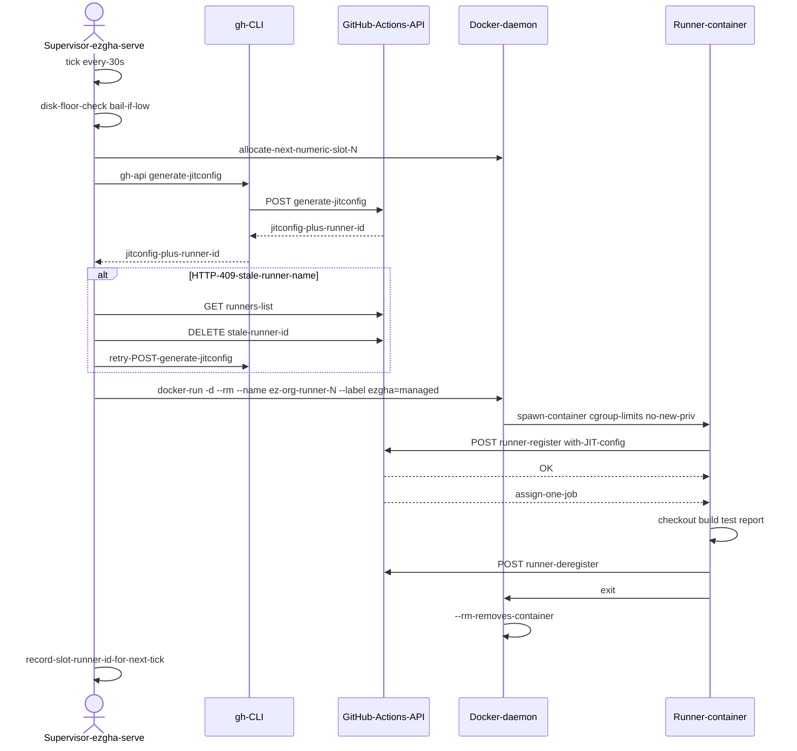
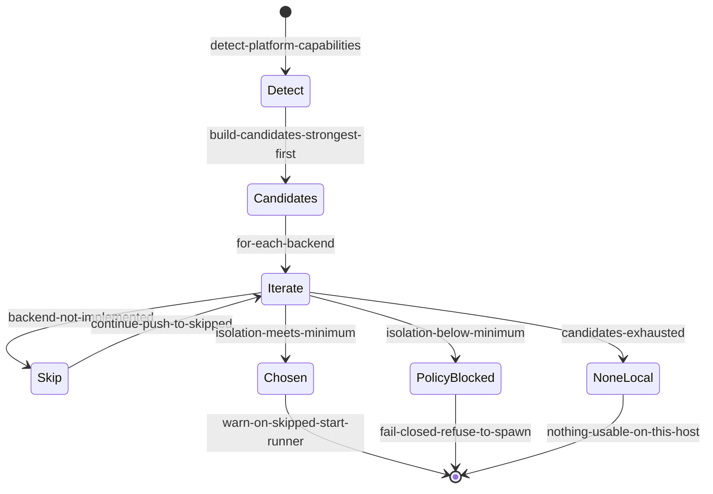
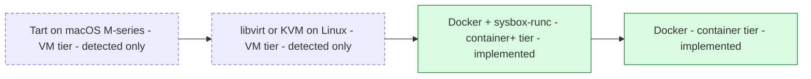

# ez-gh-actions — Design (v1)

Easy isolated self-hosted GitHub Actions runners: multi-layer isolation (container-in-VM-in-host stack) with VM-preferred backend selection.

> **Visual**: a static architecture diagram lives at
> [`docs/architecture.svg`](docs/architecture.svg) (also rendered inline in the
> README). The rest of this document is the prose version of that diagram + the
> adversarial review that produced v1.

## Isolation model — multi-layer stack (container-in-VM-in-host)

`ezgha` uses a **multi-layer isolation** strategy. Each runner workload executes
inside a container, which itself runs inside a VM (Colima / Lima / Docker Desktop on
macOS; QEMU microVM on Linux per `policy.minimum_isolation = "vm"`), which itself
runs on the host OS. The host kernel can never be reached directly by the runner
process.

There are four entities in the stack — the runner container, the Docker daemon,
the VM (when present), and the host OS — composing three boundaries between the
runner process and your host kernel: container → VM → host.

```
┌────────────────────────────────────────────────────────────────┐
│ Layer 4 — Host OS / host kernel                                │
│   sees: hypervisor process (Colima/QEMU), nothing else         │
│   ┌──────────────────────────────────────────────────────────┐ │
│   │ Layer 3 — VM (Apple vz / QEMU / KVM)                     │ │
│   │   sees: VM kernel + userspace, isolated from host        │ │
│   │   ┌────────────────────────────────────────────────────┐ │ │
│   │   │ Layer 2 — Docker daemon                            │ │ │
│   │   │   sees: container processes, image storage         │ │ │
│   │   │   ┌──────────────────────────────────────────────┐ │ │ │
│   │   │   │ Layer 1 — Runner container                   │ │ │ │
│   │   │   │   sees: only its own PID/mount/net ns        │ │ │ │
│   │   │   │   runs: actions/runner, 1 job, then exits    │ │ │ │
│   │   │   └──────────────────────────────────────────────┘ │ │ │
│   │   └────────────────────────────────────────────────────┘ │ │
│   └──────────────────────────────────────────────────────────┘ │
└────────────────────────────────────────────────────────────────┘
```

Three valid topologies, chosen automatically by `select()` from the backend ladder
below based on what the host offers and what `policy.minimum_isolation` requires:

1. **Container on host** — Docker daemon on bare metal. Container boundary only
   (cgroup + namespaces + `no-new-privileges`). The host kernel is the only boundary.
2. **Container inside VM** *(Mac dev setup, also Linux with QEMU)* — Docker daemon
   already runs inside a Colima / Lima / Docker Desktop VM (macOS) or a QEMU
   microVM (Linux). Two boundaries: container → VM hypervisor → host kernel.
   Detected via `docker info` kernel ≠ host `uname` kernel on Linux; on macOS the
   check is unconditional (every Mac Docker daemon runs in a VM since macOS has
   no native Linux kernel). This is the deployed reality on Mac (Colima) and
   jeff-ubuntu (QEMU).
3. **Container inside dedicated VM** *(M2 roadmap)* — Each job in its own Tart (macOS)
   or libvirt/KVM (Linux) VM. Hardware virtualization; no shared kernel with the host.

The stack has no nested VM backends. `select()` picks exactly one isolation
boundary per host and refuses to start work if the host can't satisfy the policy.
The earlier "VM-within-VM" terminology referred to this same 3-layer container-in-
VM-in-host stack and was retired in favor of the simpler "multi-layer isolation"
framing to avoid confusion with nested-VM-backend topologies (libvirt inside
Colima, KVM inside QEMU) that are not implemented.

## Per-layer breakdown (what each layer is and what it enforces)

From the runner process outward, four layers compose the stack. Each layer enforces
its own boundary and explicitly does not enforce the others — that is the point of
composing them.

### Layer matrix (who enforces what)

| | **Layer 1** Runner container | **Layer 2** Docker daemon | **Layer 3** VM | **Layer 4** Host OS |
|---|---|---|---|---|
| **Lives where** | OCI container on the daemon | `dockerd` (in VM or on host) | Hypervisor guest | Physical machine |
| **Lifecycle owner** | `ezgha serve` (created, --rm) | VM init / systemd | Host boot | Always on |
| **Enforces — files / PIDs** | cgroups + namespaces | storage driver isolation | VM disk quota | OS file permissions |
| **Enforces — privileges** | `--security-opt no-new-privileges` | daemon API auth | hypervisor sandboxing | SIP / filevault / secure boot |
| **Enforces — network** | net namespace | bridge / NAT through VM | VM NIC isolation | host firewall |
| **Enforces — resources** | `--memory`, `--cpus`, `--pids-limit` | (inherits from VM) | VM RAM/vCPU caps | host kernel cgroups |
| **Detected by `ezgha`** | `docker ps` (managed label) | `docker version` | `kvm_usable`, `has_tart`, `daemon_in_vm` | n/a (always there) |
| **`ezgha` config knobs** | `[runner]` image, count | n/a (uses daemon) | n/a (uses hypervisor) | `[limits] min_free_disk_gb` |
| **Source file** | `src/docker_backend.rs` | `src/docker_backend.rs`, `src/platform.rs` | `src/platform.rs::daemon_in_vm` | `src/service.rs` |

Reading the matrix: each layer enforces ONE class of boundary (files, privileges,
network, resources) and the others are explicitly not its job. Composing them gives
the full multi-layer guarantee.

### Layer 1 — Runner container (inner-most)

- **Tech**: OCI/Docker container running
  [`ghcr.io/actions/actions-runner`](https://github.com/actions/runner) (or
  `ezgha-runner:latest` from `Dockerfile.runner`).
- **Lifecycle**: created by `ezgha serve` via `docker run --rm …`, JIT-registers with
  GitHub, runs **exactly one workflow job**, deregisters, exits; `--rm` removes the
  container on exit.
- **Enforces**: Linux cgroups (hard memory / CPU / PID ceilings),
  Linux namespaces (PID / mount / network / UTS / IPC / user),
  `--security-opt no-new-privileges` (blocks setuid + capability escalation;
  sudo cannot gain root — `no_new_privs` is set on the container's init process).
- **Does NOT enforce**: kernel-level exploits. A container kernel CVE (e.g. CVE
  in the shared cgroup/namespace surface) escapes into the host userspace — the
  VM's userspace, in the deployed topology, not your laptop's kernel.
- **Config knobs**: `[runner]` (image, count) + `[limits]` (memory_mb, cpus, pids,
  min_free_disk_gb) in `~/.config/ezgha/config.toml`.
- **Source**: `src/docker_backend.rs`.

### Layer 2 — Docker daemon

- **Tech**: `dockerd` running inside the VM (Layer 3) on both Mac and jeff-ubuntu;
  on bare-metal Linux servers it runs directly on the host kernel.
- **Lifecycle**: long-lived; started by the VM's init system on boot, restarted by
  the VM if it crashes. Independent of `ezgha serve` and of any individual runner
  container.
- **Enforces**: container image isolation (clean image per job, no `RUNNER_TOKEN`
  baked in), Docker API authentication (Unix socket / TCP), storage driver isolation
  (`overlay2` on Linux, `vfs` on Mac via Colima) so one container's filesystem
  cannot read another's.
- **Does NOT enforce**: it is a userspace process. A kernel exploit that reaches
  the daemon is now inside the VM, not on the host kernel — but it is also no longer
  confined to a single container.
- **Config knobs**: standard `daemon.json`; `ezgha` detects sysbox-runc runtime when
  present and prefers it for stronger container isolation (see Backend ladder below).
- **Source**: `src/docker_backend.rs` (talks to daemon), `src/platform.rs`
  (capability detection).

### Layer 3 — VM (the optional hardware-virtualization boundary)

- **Tech**: on macOS — Colima / Lima / Docker Desktop, a Linux VM (typically Ubuntu
  or Debian cloud image) running on the macOS hypervisor (Apple Virtualization
  framework `vz` on Apple Silicon, `qemu` on Intel). On Linux — a QEMU microVM
  (or, for M2, libvirt/KVM) on the Linux host's `/dev/kvm`.
- **Lifecycle**: started at host boot (or via `limactl start colima`,
  `systemctl --user start ezgha.service` prereqs). Independent of `ezgha serve`.
- **Enforces**: hardware virtualization (separate kernel from host), VM resource
  limits (the hypervisor caps RAM/vCPUs/disk; the container cannot exhaust host
  resources, only VM quota), VM network isolation (bridged or NAT'd).
- **Detection by `ezgha`**: `src/platform.rs::daemon_in_vm()` compares
  `docker info --format '{{.KernelVersion}}'` against host `uname -r`. A mismatch
  means the daemon is inside a VM. `select()` in `src/backend.rs` uses this signal
  to satisfy `policy.minimum_isolation = "vm"` automatically — no manual wiring
  required. On macOS this comparison is short-circuited (every Mac Docker daemon
  is VM-contained by construction).
- **Does NOT enforce**: VM escape. That is a real (rare) attack class. `ezgha` does
  not claim VM-escape immunity; it claims the **host blast-radius** is bounded by
  the VM (at worst, the attacker reaches the VM's userspace, not your host kernel).
- **Config knobs**: standard Colima/Lima/QEMU configuration; `ezgha` only needs
  the daemon reachable.

### Layer 4 — Host OS / host kernel (outer-most)

- **Tech**: physical machine's OS — macOS (Darwin) on the Mac fleet, Ubuntu on
  jeff-ubuntu.
- **Enforces**: hypervisor sandboxing (Apple Virtualization framework `vz`, KVM)
  with a minimal device model; standard OS hardening (filevault, SIP, secure boot).
- **`ezgha`'s contribution on this layer**: `ezgha serve` runs as a **user
  service** (`systemd --user` or `launchd` LaunchAgent), not as root, not as a
  system service. Compromise of `ezgha` itself does not grant root without an
  additional exploit. Disk floor guard (`min_free_disk_gb`) lives here. No
  docker.sock, no privileged mode, no extra `--cap-add`.
- **Does NOT enforce**: this layer is **your** job to keep patched — Apple
  security updates, Ubuntu `unattended-upgrades`. `ezgha` is not a substitute.
- **Source**: `src/service.rs` (user-level systemd / launchd install).

### Composition

The four-entity / three-boundary stack is shown at the top of this section. The
runner container sits inside the Docker daemon, which sits inside the VM (when
present), which sits on the host OS. Each layer is enforced by a different
mechanism — the container by cgroups/namespaces/no-new-priv, the VM by hardware
virtualization, the host by OS hardening.

A malicious job would need to break **all three boundaries** (cgroup/namespace →
VM hypervisor → host kernel). Layers 1–3 are mitigated by Layer 3's hardware
virtualization; Layer 4 is OS hardening.

## Origin of this design

This design is the **adjusted** version of the original `gha-isolated` proposal
([gist](https://gist.github.com/jleechan2015/f487a9773f650719680d27d0f8ad6c07)),
rewritten after a 32-agent adversarial review (4 independent reviewers — facts/web,
architecture, Rust, existing-infra fit — with every critical/major finding
adversarially verified: 26 confirmed, 2 refuted).

## What changed from the original proposal, and why

| # | Original proposal | Adjusted design | Verified reason |
|---|---|---|---|
| 1 | Wrap `gha-outrunner` | **Self-contained** — drive Docker/GitHub directly | `gha-outrunner` exists (NetwindHQ/gha-outrunner) but has 3 stars, 0 forks, 1 maintainer: a bus-factor-1 load-bearing dependency. Its real interface also doesn't match the proposal (config.yml not outrunner.yml, no start/stop/status subcommands, no pids_limit). |
| 2 | "GitHub Scale Sets + ephemeral" | **JIT runners** (`generate-jitconfig` API) | JIT registration is the standalone-correct primitive: one job per runner, auto-deregister, no token to store. (Scale sets outside k8s are now legitimate via GitHub's `actions/scaleset` Go client, but JIT is simpler and sufficient at this scale.) |
| 3 | No registration/auth story | All GitHub API access via the **`gh` CLI** (inherits its auth) | Confirmed critical gap: the original config could never produce a working runner. v1 requirement: `gh auth login`. |
| 4 | YAML config via `serde_yaml`, written to cwd, format!-templated | **TOML** typed serde structs, versioned (`version = 1`), in the XDG config dir | `serde_yaml` is archived/deprecated; cwd writes silently clobber; string templating is unvalidatable. |
| 5 | Silent fallback to weakest backend | **Fail-closed isolation policy**: `policy.minimum_isolation = "vm" \| "container"` | Confirmed major: isolation downgrades must be explicit, never silent. |
| 6 | Hardcoded 4G/2cpu/count:2 | Limits **derived from host capacity** (½ RAM clamped to [2 GiB, 16 GiB], ½ cores), overridable in config | Confirmed major: fixed limits contradict the tool's own resource-protection principle. |
| 7 | No disk story | **Disk floor guard**: refuse to spawn runners when free disk < `min_free_disk_gb` (default 10) | Confirmed critical (infra-fit): disk exhaustion is the dominant incident class in the existing runner fleet. Ephemeral `--rm` containers also make workspace debris die with the job. |
| 8 | `/dev/kvm` existence check | Open `/dev/kvm` read-write to verify **permissions**, and require `virsh` | Confirmed major: existence without kvm-group membership selects a backend that fails at runtime. |
| 9 | "Assume Sysbox is installed" | Detect `sysbox-runc` in `docker info` runtimes; only use it when actually present | Confirmed major landmine. Sysbox-CE is alive (v0.7.0, Docker-sponsored). |
| 10 | `sysinfo` crate (init discarded) + `duct` + `colored` | `std::process` + `/proc/meminfo` + `available_parallelism` — 7 small deps total | Confirmed major: heavyweight deps for discarded data. |
| 11 | Service management "not yet implemented" | **Implemented v1**: systemd `--user` unit / launchd plist generated from the running binary path, enabled immediately | Confirmed major: unattended operation is a prerequisite, not a stretch goal. |
| 12 | "GCE has no strong KVM" | GCE **supports nested virtualization** on Intel x86 machine types (not E2/AMD/Arm) — libvirt is a valid future backend on GCE | Confirmed factual error in the original. |

Refuted findings (kept for the record): the "no ephemeral lifecycle" architecture claim
was refuted as written (the original delegated lifecycle to the wrapper) — moot here since
v1 owns the lifecycle; a duplicate module-table finding was folded into #11.

## Core loop

```
ezgha serve
  └── every 30s: ensure N managed runner containers are alive
        ├── disk floor check (fail loudly, spawn nothing when low)
        ├── POST …/actions/runners/generate-jitconfig   (via gh api)
        └── docker run -d --rm
              --memory/--memory-swap/--cpus/--pids-limit   (hard cgroup limits)
              --security-opt no-new-privileges
              [--runtime sysbox-runc when available]
              ghcr.io/actions/actions-runner ./run.sh --jitconfig <jit>
```

A JIT runner accepts **exactly one job**, then deregisters and exits; `--rm` removes the
container; `serve` spawns a fresh one. Every job gets a pristine filesystem — the
workspace-pollution / zombie-runner / cache-corruption class of incidents is eliminated
by construction rather than by cleanup scripts.

### One-job lifecycle (sequence)



The two arrows into GitHub (`generate-jitconfig` and `runner/register`) are the only
places where `ezgha`-controlled bytes cross the host-kernel boundary — both go through
the user's authenticated `gh` session.

## Backend selection (`select()`)

`select(platform, minimum_isolation)` returns one of three outcomes:



- **`Chosen{backend, skipped_stronger}`** — strongest implemented backend satisfying
  policy. `skipped_stronger` carries the unimplemented VM backends so the caller can
  warn the operator (we don't silently downgrade).
- **`PolicyBlocked{best_available, required}`** — host offers a usable backend but
  policy demands stronger isolation. Hard error; `serve` keeps running so a config
  edit takes effect.
- **`None`** — host has nothing usable at all.

## Backend ladder (strongest first)



| Backend | Isolation | v1 status |
|---|---|---|
| Tart (macOS Apple Silicon) | VM | detected, reported by `doctor`; drive in M2 |
| libvirt/KVM (Linux) | VM | detected (incl. permission check), drive in M2 |
| Docker + sysbox-runc | container+ | **implemented** |
| Docker | container | **implemented** |

`select()` picks the strongest *implemented* backend that satisfies
`policy.minimum_isolation`; anything stronger-but-unimplemented produces a warning, and a
policy violation is a hard error (fail closed).

**Daemon-in-VM reclassification.** For the `minimum_isolation = "vm"` policy, a Docker
backend counts as VM-grade containment when the daemon itself runs inside a VM — the
common desktop/dev setups (Colima, Lima, Docker Desktop) — because the host blast-radius
is then bounded by the VM, not just the cgroup. We detect this by comparing the daemon's
kernel (`docker info`) against the host kernel (`uname`): a mismatch means containers
execute against a different kernel, i.e. inside a VM. Per-job isolation is still
container-grade in this case; the guarantee the policy makes is host blast-radius. A
bare-metal docker daemon (kernels match) stays container-tier and is **refused** under a
`vm` policy, so the fail-closed contract holds on Linux servers where docker shares the
host kernel.

## Module map

| File | Responsibility |
|---|---|
| `src/main.rs` | clap CLI: `init`, `doctor`, `start`, `serve`, `stop`, `status`, `install-service` |
| `src/platform.rs` | capability detection (KVM rw-open, tart, virsh, docker daemon, sysbox runtime, RAM/CPU) |
| `src/backend.rs` | backend ladder, fail-closed selection (unit-tested) |
| `src/config.rs` | versioned TOML config, capacity-derived defaults (unit-tested) |
| `src/github.rs` | JIT config, runner list/remove via `gh api` |
| `src/docker_backend.rs` | container lifecycle, hard limits, disk floor guard |
| `src/service.rs` | systemd `--user` / launchd install |

## Security posture (v1)

- No docker.sock mounted into runners; no privileged containers; `no-new-privileges`.
- Hard cgroup ceilings (memory+swap, cpus, pids) so a runaway job dies in its cgroup.
- JIT config is passed as a container argument (visible to local `docker inspect`;
  acceptable single-user-host tradeoff — it is single-use and expires).
- Public-repo caution: keep default workflow triggers to `workflow_dispatch`/protected
  branches; do not enable fork-PR jobs on self-hosted runners.

## Milestones

- **M1 (this repo, done)**: docker backend end-to-end, JIT ephemeral, limits, disk floor,
  service install, doctor.
- **M2**: drive libvirt (cloud-image + cloud-init) and Tart; per-job VMs.
- **M3**: health/queue-depth monitoring + alerting hooks (port the battle-tested
  heal/monitor semantics from `worldarchitect.ai/self-hosted-oss`).
- **M4**: org-scope fleet config, multiple runner pools/labels.

## Known limitations (v1)

From the post-implementation adversarial /er + code review (15-agent workflow; two
confirmed criticals were fixed immediately — daemon-side disk measurement, host-scoped
runner deregistration). Confirmed-major items deferred, in priority order:

- **Crash-looping runner containers leak JIT registrations**: a container that starts
  then dies (`--rm`) is invisible to `managed_containers()`, so `serve` respawns with a
  new JIT config each cycle and never cleans the orphaned registration; no backoff.
  Mitigation planned: reconcile GitHub's runner list (host-scoped prefix) each serve
  cycle + exponential backoff on repeated immediate exits.
- **`ezgha stop` does not stop the installed service**: with `install-service` active,
  `serve` respawns runners within 30s of `stop`. Stop should also `systemctl --user stop`
  / `launchctl unload` (or take a run lock shared with serve/start).
- **`docker ps --format json` requires Docker CLI ≥ 23**: older CLIs (Ubuntu 22.04
  `docker.io`) print the literal template. Needs a version probe or `--format '{{json .}}'`.
- **Managed label is not target-scoped**: two configs on one host sharing the daemon
  would miscount each other's capacity; label should include the target.
- **Container hardening gaps**: no `--cap-drop ALL`, no egress restriction, no read-only
  rootfs. `no-new-privileges` + cgroup limits + no docker.sock are accurate but partial.
- **JIT config visible in argv/docker inspect** on the runner host (single-use,
  short-lived; treat the host as single-tenant until delivered via file/env).
- Requires the `gh` CLI to be authenticated; no GitHub App auth yet.
- Tart/libvirt are detect-only; VM isolation is not yet delivered (the ladder and policy
  are wired so it lands without config changes).
- No per-job disk quota (docker storage-opt needs specific storage drivers); the floor
  guard bounds daemon-level damage instead.
- `serve` is a foreground loop under systemd/launchd; no HTTP health endpoint yet.
