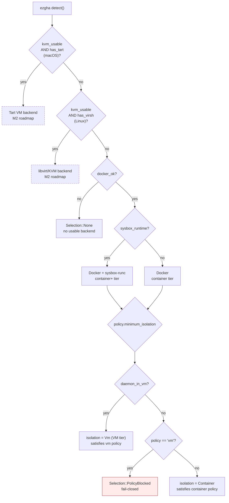
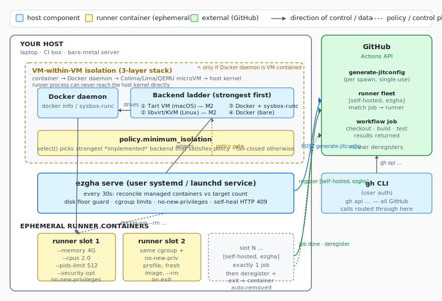
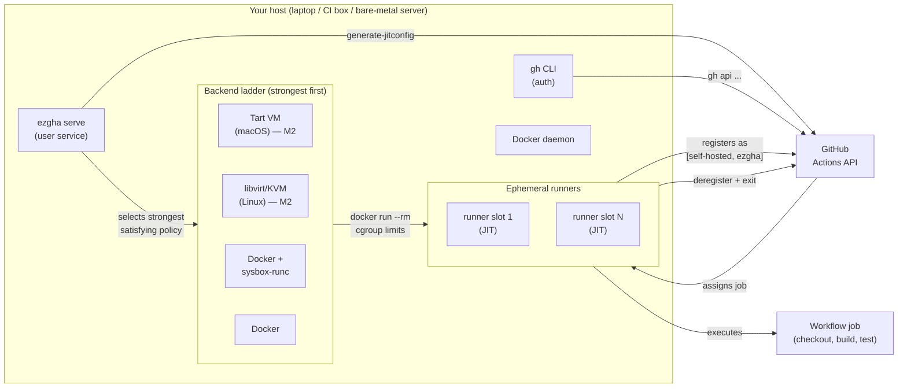
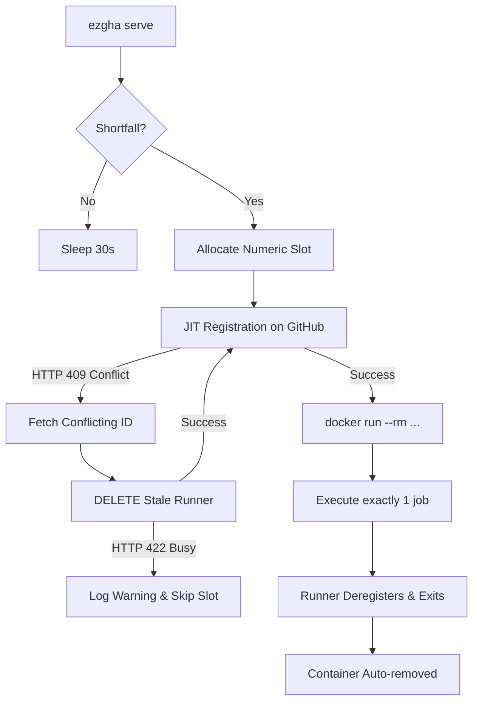

# ez-gh-actions (`ezgha`)

Easy **isolated** self-hosted GitHub Actions runners. One Rust binary that:

- runs each job in a **fresh ephemeral runner** (GitHub JIT registration — one job, then
  the runner deregisters and its container is removed),
- applies **hard resource limits** (memory, CPUs, PIDs) so a runaway job can't take the
  host down,
- **prefers the strongest isolation the host can deliver** (VM backends on the roadmap;
  Docker and Docker+sysbox today) and **fails closed** when policy demands more than
  the host offers,
- refuses to spawn work when disk is nearly full (the classic runner death spiral),
- installs itself as a user service (systemd `--user` / launchd).

The full design — including the 32-agent adversarial review that shaped v1 — lives in
[DESIGN.md](DESIGN.md). A static architecture diagram is at
[`docs/architecture.svg`](docs/architecture.svg).

## How isolation works

`ezgha` runs **one ephemeral container per job** on a host you control. The runner is
JIT-registered with GitHub, executes exactly one workflow job, then deregisters and the
container is removed (`--rm`). Each job starts from a clean filesystem — workspace
pollution, zombie runners, and cache corruption are eliminated by construction.

The actual isolation is a **multi-layer stack** between the runner process and your
host kernel. From the runner outward, four entities (container, Docker daemon, VM,
host OS) compose three boundaries (container → VM → host) that the runner must
cross to reach your data:

```
┌─────────────────────────────────────────────────────────────┐
│ Layer 4 — Host OS / host kernel                             │
│   sees: hypervisor process (Colima/QEMU), nothing else      │
│   ┌───────────────────────────────────────────────────────┐ │
│   │ Layer 3 — VM (Apple vz / QEMU / KVM)                  │ │
│   │   sees: VM kernel + userspace, isolated from host     │ │
│   │   ┌─────────────────────────────────────────────────┐ │ │
│   │   │ Layer 2 — Docker daemon                         │ │ │
│   │   │   sees: container processes, image storage      │ │ │
│   │   │   ┌───────────────────────────────────────────┐ │ │ │
│   │   │   │ Layer 1 — Runner container                │ │ │ │
│   │   │   │   sees: only its own PID/mount/net ns     │ │ │ │
│   │   │   │   runs: actions/runner, 1 job, then exits │ │ │ │
│   │   │   └───────────────────────────────────────────┘ │ │ │
│   │   └─────────────────────────────────────────────────┘ │ │
│   └───────────────────────────────────────────────────────┘ │
└─────────────────────────────────────────────────────────────┘
```

`ezgha` enforces the **container boundary** (hard cgroup limits, `--security-opt
no-new-privileges`) and **detects whether the VM boundary is present** (via
`docker info` kernel vs `uname -r`). The host kernel boundary is your OS hardening
job — no tool can substitute for keeping the host patched.

The isolation model has three valid topologies, chosen automatically based on what
your host offers and what your policy requires:

| Topology | Where the container runs | Boundaries between job and host kernel | When `ezgha` picks it |
|----------|--------------------------|---------------------------------------|-----------------------|
| **Container on host** | Docker daemon on bare metal / Linux server | Container only | Default; `policy.minimum_isolation = "container"` |
| **Container inside VM** | Docker daemon running inside a Colima / Lima / Docker Desktop VM | Container + VM hypervisor | Detected via `docker info` kernel ≠ host kernel; satisfies `policy.minimum_isolation = "vm"` |
| **Container inside dedicated VM** *(roadmap — M2)* | Each job in its own Tart (macOS) or libvirt/KVM (Linux) VM | Hardware virtualization; no shared kernel | Roadmap; detected and reported by `ezgha doctor` today, drivers land in M2 |

### Topology decision tree



Read the tree: on macOS every Docker daemon is automatically VM-contained (the
`daemon_in_vm?` branch is unconditional per `src/platform.rs:112-113`), so a Mac
running `policy.minimum_isolation = "vm"` always satisfies it. On Linux, a bare-metal
Docker daemon fails closed under a `vm` policy — `ezgha` refuses to spawn and the
operator either sets `minimum_isolation = "container"` or adds a VM (Colima on Mac,
QEMU on Linux).

See [DESIGN.md §"Isolation model"](DESIGN.md#isolation-model-multi-layer-stack)
and the [architecture diagram](docs/architecture.svg) for the full picture.

## What each layer does

Each layer enforces its own boundary and explicitly does not enforce the others —
that is the point of composing them.

### Layer 1 — Runner container (inner-most)

- **What it is**: an OCI/Docker container running
  [`ghcr.io/actions/actions-runner`](https://github.com/actions/runner) (or
  `ezgha-runner:latest` if you build the [custom image](#custom-runner-image)).
- **Lifecycle**: created by `ezgha serve` via `docker run --rm …`, JIT-registers with
  GitHub, runs **exactly one workflow job**, deregisters, exits. The container is
  removed by `--rm` on exit.
- **What enforces isolation**:
  - **Linux cgroups** — hard ceilings on memory (`--memory` + `--memory-swap`),
    CPU (`--cpus`), and process count (`--pids-limit`). A runaway job dies inside
    its cgroup; the host can't be OOM-killed by a single job.
  - **Linux namespaces** — PID, mount, network, UTS, IPC, user. The runner sees
    only its own processes, mounts, hostname, network namespace.
  - **`--security-opt no-new-privileges`** — blocks setuid binaries and capability
    escalation. Sudo cannot gain root inside the container: even if a job runs
    `apt install sudo && sudo su`, the kernel refuses the privilege change because
    `no_new_privs` is set on the container's init process.
- **What it does NOT enforce**: it does not stop a kernel-level exploit (CVE in the
  shared kernel) from escaping into the host's user-space. That is what the next
  layer is for.
- **Configuration knobs** (in `~/.config/ezgha/config.toml` `[runner]` /
  `[limits]`): `image`, `count`, `memory_mb`, `cpus`, `pids`, `min_free_disk_gb`.

### Layer 2 — Docker daemon (manages the containers)

- **What it is**: `dockerd` — the long-lived daemon that creates and tears down
  containers. On Mac and on jeff-ubuntu this daemon runs **inside the VM**
  (Layer 3), not on the bare host kernel. On a bare-metal Linux server with
  Docker installed directly, it runs on the host kernel directly.
- **Lifecycle**: long-lived; started by the VM (Colima/QEMU) or the host
  (bare-metal) on boot, restarted by the VM's init system or systemd if it
  crashes. Independent of `ezgha serve`.
- **What enforces isolation**:
  - **Container image isolation** — runners start from a clean image every time
    (no `RUNNER_TOKEN` baked in, no shared mutable layers between jobs).
  - **Docker API authentication** — `ezgha` talks to the daemon over its Unix
    socket (or TCP if configured) using standard `docker run` flags.
  - **Docker storage driver** — `overlay2` (Linux) or `vfs` (Mac via Colima).
    Stops one container's filesystem from reading another's.
- **What it does NOT enforce**: it is a userspace process. A kernel exploit in the
  container's syscall surface can reach the daemon, and then the daemon's host
  (which is the VM's userspace, not your laptop's kernel, on Mac/jeff-ubuntu).
- **Configuration knobs**: standard `daemon.json`; `ezgha` detects sysbox-runc
  runtime when present and uses it for stronger container isolation (see [Backend
  ladder](#backends-isolation-ladder)).

### Layer 3 — VM (the optional hardware-virtualization boundary)

- **What it is**: on macOS — Colima / Lima / Docker Desktop, a Linux VM
  (typically a recent Ubuntu or Debian cloud image) running on the macOS
  hypervisor (Apple Virtualization framework `vz` on Apple Silicon, `qemu` on
  Intel). On Linux — a QEMU microVM (or, for M2, libvirt/KVM) running on the Linux
  host's hardware virtualization (`/dev/kvm`).
- **Lifecycle**: started at host boot (or via `limactl start colima` /
  `systemctl --user start ezgha.service`'s prereq). Independent of `ezgha serve`
  and of any individual runner container.
- **What enforces isolation**:
  - **Hardware virtualization** — the VM's kernel is fully separate from the
    host kernel. The container's kernel exploits cannot reach the host kernel
    directly; they would first need to break out of the VM (a much harder,
    rarer, and more-researched class of bug).
  - **VM resource limits** — the hypervisor can cap VM RAM, vCPUs, and disk.
    The container cannot exhaust the host's resources; it can only exhaust
    the VM's quota.
  - **VM network isolation** — the VM's network is bridged or NAT'd through
    the host. A container cannot bind to the host's IP directly.
- **Detection by `ezgha`**: `ezgha doctor` (and `init`) compares the daemon's
  kernel version (`docker info --format '{{.KernelVersion}}'`) against the host
  kernel (`uname -r`). A mismatch means the daemon is running inside a VM.
  On **macOS** this comparison is short-circuited: any successful `docker info`
  probe is treated as VM-contained, because every Mac Docker daemon runs inside
  a Colima / Lima / Docker Desktop VM (macOS has no native Linux kernel).
  This is how `ezgha` automatically satisfies `policy.minimum_isolation = "vm"`
  without you having to wire it up manually.
- **What it does NOT enforce**: VM escape is a real (rare) attack class.
  `ezgha` does not claim VM-escape immunity; it claims the **host blast-radius**
  is bounded by the VM (at worst, the attacker reaches the VM's userspace, not
  your host kernel).
- **Configuration knobs**: standard Colima/Lima/QEMU config; `ezgha` only needs
  the docker daemon reachable.

### Layer 4 — Host OS / host kernel (outer-most)

- **What it is**: your physical machine's OS — macOS (Darwin) on the Mac fleet,
  Ubuntu on jeff-ubuntu. The host kernel sees only the hypervisor process
  (Colima/QEMU/libvirt), never the containers directly.
- **What it enforces**:
  - **Hypervisor sandboxing** — modern hypervisors (Apple Virtualization
    framework `vz`, KVM) run the guest with a minimal device model. The host
    kernel refuses most cross-boundary syscalls.
  - **Standard OS hardening** — filevault, SIP, secure boot, etc.
- **What `ezgha` enforces on this layer**:
  - **`ezgha serve` runs as a user service** (`systemd --user` or `launchd`
    LaunchAgent), not as root, not as a system service. Compromise of
    `ezgha` itself cannot escalate to root without an additional exploit.
  - **Disk floor guard** — `ezgha serve` refuses to spawn new runners when
    the Docker volume drops below `min_free_disk_gb` (default 10 GB).
  - **No docker.sock mounted into runners**, no privileged mode, no
    `--cap-add` beyond the defaults.
- **What it does NOT enforce**: nothing in `ezgha` is a substitute for keeping
  the host OS patched (Apple security updates, Ubuntu `unattended-upgrades`).

The orchestrator that crosses these layers is `ezgha serve`, which lives in
Layer 4 (host userspace) and drives the Layer 2 daemon. The runner itself
cannot cross these layers unaided.

## Install

```bash
git clone https://github.com/jleechanorg/ez-gh-actions
cd ez-gh-actions && ./install.sh
```

`install.sh` is idempotent and needs no sudo: it checks prerequisites (git, Rust, a
reachable Docker daemon, an authenticated `gh`), builds and installs the `ezgha`
binary, and prints the guided next steps below. Re-run it any time to upgrade.
Uninstall with `./install.sh --uninstall` (your config is left in place).

Claude Code users get an install + diagnosis walkthrough from the
[`ezgha-install`](.claude/skills/ezgha-install/SKILL.md) skill.

## Quick start

```bash
# prerequisites: docker daemon, gh CLI authenticated (gh auth login)
cargo install --path .              # or: ./install.sh

ezgha init --target owner/repo        # detect host, write ~/.config/ezgha/config.toml
ezgha doctor                          # see backends, limits, auth status
ezgha start                           # launch ephemeral runner(s) now
ezgha status                          # managed containers + registered runners
ezgha serve                           # supervise: keep N ephemeral runners available
ezgha install-service                 # run `serve` at login, restart on failure
ezgha stop                            # kill containers, deregister idle runners
```

Point a workflow at it:

```yaml
runs-on: [self-hosted, ezgha]
```

## Architecture

### System diagram



Static SVG at [`docs/architecture.svg`](docs/architecture.svg). The same diagram in
Mermaid (renders inline on GitHub):



### Supervisor loop (per-spawn detail)

The `ezgha serve` loop runs every 30 seconds, reconciles managed containers against the
target count, and spawns shortfalls.



### Key components

1. **Supervisor loop (`ezgha serve`)** — Run as a user-level service (systemd or launchd).
   Every 30 seconds it reconciles active Docker containers against the target runner
   count and spawns shortfalls.
2. **Resilient spawning & graceful degradation** — Spawning is decoupled and
   slot-independent. If JIT registration or container spawning fails for slot *N*
   (e.g. a runner with that name is still busy on GitHub), the error is logged, the
   slot is skipped for the rest of the spawn cycle to prevent thrashing, and the daemon
   continues spawning subsequent slots.
3. **Self-healing conflict resolution** — If `generate-jitconfig` fails with an
   `HTTP 409 (Already Exists)` conflict due to a stale runner registration, the daemon
   automatically queries the GitHub API, deletes the conflicting offline runner, and
   retries the registration.
4. **Hard security & isolation gates**:
   - **Cgroup constraints** — Limits are derived dynamically from host capacity or set
     explicitly in the config (clamping memory, swap, CPUs, and PIDs).
   - **No-new-privileges** — Containers are started with `--security-opt
     no-new-privileges`. This blocks privilege escalation (`sudo` is disabled inside
     the runner container).
   - **Disk floor guard** — Measures disk space on the Docker daemon's volume before
     spawning and refuses to launch new runners if free space falls below
     `min_free_disk_gb` (preventing runner disk-exhaustion deaths).

## Backends (isolation ladder)

| Backend | Isolation | v1 status |
|---------|-----------|-----------|
| Tart (macOS Apple Silicon) | **VM** | detected, reported by `ezgha doctor`; driving runners lands in **M2** |
| libvirt/KVM (Linux) | **VM** | detected (incl. permission check), driving runners lands in **M2** |
| Docker + sysbox-runc | container+ (stronger) | **implemented** |
| Docker (bare daemon) | container | **implemented** |

`select()` picks the strongest *implemented* backend that satisfies
`policy.minimum_isolation`. Anything stronger-but-unimplemented produces a warning; a
policy violation is a hard error (fail closed).

**Daemon-in-VM reclassification.** For `policy.minimum_isolation = "vm"`, a Docker
backend counts as VM-grade containment when the daemon itself runs inside a VM — the
common desktop/dev setups (Colima, Lima, Docker Desktop) — because the host blast
radius is then bounded by the VM, not just the cgroup. We detect this by comparing the
daemon's kernel (`docker info`) against the host kernel (`uname`): a mismatch means
containers execute against a different kernel, i.e. inside a VM. Per-job isolation is
still container-grade in this case; the guarantee the policy makes is **host blast
radius**. A bare-metal Docker daemon (kernels match) stays container-tier and is
**refused** under a `vm` policy, so the fail-closed contract holds on Linux servers
where Docker shares the host kernel.

## Config (`~/.config/ezgha/config.toml`)

```toml
version = 1

[github]
scope = "repo"                  # or "org"
target = "owner/repo"           # "org-name" for org scope

[runner]
labels = ["self-hosted", "ezgha"]
count = 1                       # concurrent ephemeral runners to maintain
image = "ezgha-runner:latest"   # see "Custom runner image" below

[limits]                        # defaults derived from host capacity at init
memory_mb = 4096                # hard cgroup ceiling (swap pinned to same value)
cpus = 2.0
pids = 512
min_free_disk_gb = 10           # refuse to spawn below this floor

[policy]
minimum_isolation = "container" # "vm" = refuse to run jobs unless execution is
                                # VM-contained: a VM backend, OR a docker daemon that
                                # itself runs inside a VM (Colima/Lima/Docker Desktop),
                                # detected via daemon-vs-host kernel mismatch. A
                                # bare-metal docker daemon is refused under this policy.
```

## Security notes

- Runner containers get `--security-opt no-new-privileges`, no docker.sock, no
  privileged mode, and hard cgroup limits.
- JIT runners are single-use; nothing long-lived is stored on disk.
- `minimum_isolation = "vm"` means **VM-or-refuse**: jobs run only when execution is
  VM-contained — either a VM backend (M2) or a Docker daemon running inside a VM
  (Colima/Lima/Docker Desktop), detected by a daemon-vs-host kernel mismatch.
  Per-job isolation inside that VM is still container-grade; the guarantee is
  **host blast radius**. A bare-metal Docker daemon fails closed under this policy.
- On **public repos**: keep self-hosted workflows on `workflow_dispatch` / protected
  branches. Do not run fork PRs on self-hosted runners.

## Diagnostics & self-healing

### Fleet health check

```bash
./doctor.sh                      # full fleet health check
./docs/verify-exit-criteria.sh   # ironclad exit criteria (Gates 0–10)
```

`doctor.sh` checks: service liveness, Docker daemon, Colima VM, slot assignments, GitHub
runner fleet status (online/offline/busy), live managed containers, and recent job
execution proof.

`verify-exit-criteria.sh` machine-checks 7 ironclad gates:

| Gate | What it checks |
|------|----------------|
| 0 | Deployed binary SHA matches HEAD commit |
| 1 | Code builds, tests, clippy, fmt all pass |
| 2 | Service active + Docker/Colima daemon up |
| 3 | Fleet capacity meets targets (online + busy ≥ N−1, containers ≥ N−1) |
| 4 | Recent jobs executed successfully on the ezgha fleet |
| 7 | Automated monitoring scheduled and active |
| 10 | GitHub API rate limit budget is healthy |

### Custom runner image

The default `ghcr.io/actions/actions-runner:latest` image lacks `gh` and `jq`, causing
workflows that use these tools to fail with exit code 127. Build and use the custom
image:

```bash
docker build -f Dockerfile.runner -t ezgha-runner:latest .
```

### Stale container name-collision fix

If the daemon logs `docker run failed: Conflict. The container name ... is already in use`
in a loop, a stale container is occupying the slot name. Fix:

```bash
docker rm -f ez-org-runner-N   # replace N with the stuck slot number
```

The daemon (`≥ commit c6defc7`) includes a built-in failsafe that runs `docker rm -f`
before each `docker run` to prevent this loop.

### /doctor slash command

This repo registers a `/doctor` slash command (`.claude/commands/doctor.md`,
`.codex/commands/doctor.md`) that runs the diagnostic skill and auto-repairs common
failures.

## Status

**v1 (M1):** Docker backend end-to-end, JIT ephemeral, limits, disk floor, service
install, doctor. Backends Tart (macOS) and libvirt/KVM (Linux) are detected and
reported by `ezgha doctor`; driving them lands in **M2** (see [DESIGN.md](DESIGN.md)
milestones).