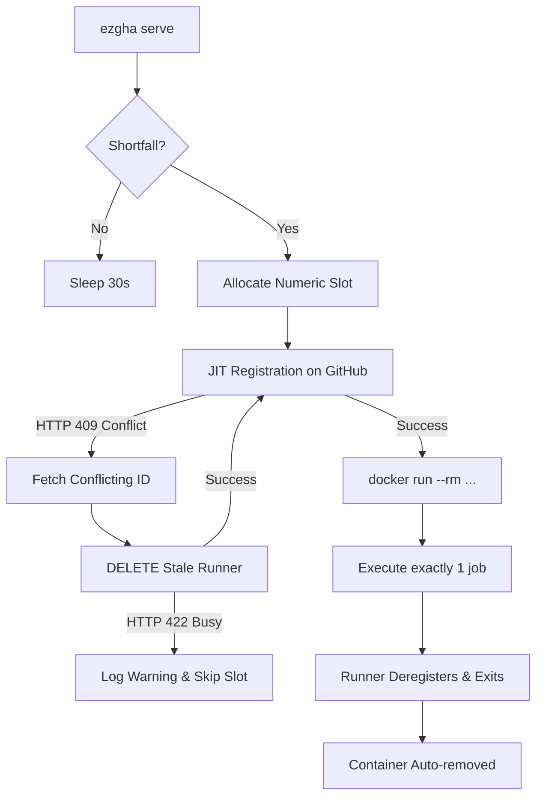

# ez-gh-actions (`ezgha`)

Easy **isolated** self-hosted GitHub Actions runners. One binary that:

- runs each job in a **fresh ephemeral runner** (GitHub JIT registration — one job, then
  the runner deregisters and its container is removed),
- applies **hard resource limits** (memory, cpus, pids) so a runaway job can't take the
  host down,
- **prefers the strongest isolation** the host offers (VM backends on the roadmap; Docker
  and Docker+sysbox today) and **fails closed** when policy demands more than the host has,
- refuses to spawn work when disk is nearly full (the classic runner death spiral),
- installs itself as a user service (systemd `--user` / launchd).

See [DESIGN.md](DESIGN.md) for the architecture and the adversarial design review that
shaped it.

## Install

```bash
git clone https://github.com/jleechanorg/ez-gh-actions
cd ez-gh-actions && ./install.sh
```

`install.sh` is idempotent and needs no sudo: it checks prerequisites (git, Rust,
a reachable docker daemon, an authenticated `gh`), builds and installs the `ezgha`
binary, and prints the guided next steps below. Re-run it any time to upgrade.
Uninstall with `./install.sh --uninstall` (your config is left in place).

Claude Code users get an install + diagnosis walkthrough from the
[`ezgha-install`](.claude/skills/ezgha-install/SKILL.md) skill.

## Quick start

```bash
# prerequisites: docker daemon, gh CLI authenticated (gh auth login)
cargo install --path .              # or: ./install.sh

ezgha init --target owner/repo        # detect host, write ~/.config/ezgha/config.toml
ezgha doctor                          # see backends, limits, auth status
ezgha start                           # launch ephemeral runner(s) now
ezgha status                          # managed containers + registered runners
ezgha serve                           # supervise: keep N ephemeral runners available
ezgha install-service                 # run `serve` at login, restart on failure
ezgha stop                            # kill containers, deregister idle runners
```

Point a workflow at it:

```yaml
runs-on: [self-hosted, ezgha]
```


## Architecture

`ezgha` is built around a supervisor loop that maintains a target count of isolated, ephemeral GitHub Actions runners.



### Key Components

1. **Supervisor Loop (`ezgha serve`)**: Run as a user-level service (systemd or launchd). Every 30 seconds, it reconciles active Docker containers against the target runner count and spawns shortfalls.
2. **Resilient Spawning & Graceful Degradation**: Spawning is decoupled and slot-independent. If JIT registration or container spawning fails for slot $N$ (e.g., because a runner with that name is still busy on GitHub), the error is logged, the slot is skipped for the rest of the spawn cycle to prevent thrashing, and the daemon continues spawning subsequent slots.
3. **Self-Healing Conflict Resolution**: If `generate-jitconfig` fails with an `HTTP 409 (Already Exists)` conflict due to a stale runner registration, the daemon automatically queries the GitHub API, deletes the conflicting offline runner, and retries the registration.
4. **Hard Security & Isolation Gates**:
   * **Cgroup Constraints**: Limits are derived dynamically from host capacity or set explicitly in the config (clamping memory, swap, CPUs, and PIDs).
   * **No-New-Privileges**: Containers are started with `--security-opt no-new-privileges`. This blocks privilege escalation (e.g. `sudo` is disabled inside the runner container).
   * **Disk Floor Guard**: Measures disk space on the Docker daemon's volume before spawning and refuses to launch new runners if free space falls below `min_free_disk_gb` (preventing runner disk-exhaustion deaths).

## Config (`~/.config/ezgha/config.toml`)

```toml
version = 1

[github]
scope = "repo"                  # or "org"
target = "owner/repo"           # "org-name" for org scope

[runner]
labels = ["self-hosted", "ezgha"]
count = 1                       # concurrent ephemeral runners to maintain
image = "ghcr.io/actions/actions-runner:latest"

[limits]                        # defaults derived from host capacity at init
memory_mb = 4096                # hard cgroup ceiling (swap pinned to same value)
cpus = 2.0
pids = 512
min_free_disk_gb = 10           # refuse to spawn below this floor

[policy]
minimum_isolation = "container" # "vm" = refuse to run jobs unless execution is
                                # VM-contained: a VM backend, OR a docker daemon that
                                # itself runs inside a VM (Colima/Lima/Docker Desktop),
                                # detected via daemon-vs-host kernel mismatch. A
                                # bare-metal docker daemon is refused under this policy.
```

## Security notes

- Runner containers get `--security-opt no-new-privileges`, no docker.sock, no
  privileged mode, and hard cgroup limits.
- JIT runners are single-use; nothing long-lived is stored on disk.
- `minimum_isolation = "vm"` means **VM-or-refuse**: jobs run only when execution is
  VM-contained — either a VM backend (M2) or a docker daemon running inside a VM
  (Colima/Lima/Docker Desktop), detected by a daemon-vs-host kernel mismatch.
  Per-job isolation inside that VM is still container-grade; the guarantee is
  **host blast-radius**. A bare-metal docker daemon fails closed under this policy.
- On **public repos**: keep self-hosted workflows on `workflow_dispatch` / protected
  branches. Do not run fork PRs on self-hosted runners.

## Diagnostics & Self-Healing

### Fleet health check

```bash
./doctor.sh                      # full fleet health check
./docs/verify-exit-criteria.sh   # ironclad exit criteria (Gates 0–10)
```

`doctor.sh` checks: service liveness, Docker daemon, Colima VM, slot assignments, GitHub runner fleet status (online/offline/busy), live managed containers, and recent job execution proof.

`verify-exit-criteria.sh` machine-checks 7 ironclad gates:

| Gate | What it checks |
|------|----------------|
| 0 | Deployed binary SHA matches HEAD commit |
| 1 | Code builds, tests, clippy, fmt all pass |
| 2 | Service active + Docker/Colima daemon up |
| 3 | Fleet capacity meets targets (online + busy ≥ N−1, containers ≥ N−1) |
| 4 | Recent jobs executed successfully on the ezgha fleet |
| 7 | Automated monitoring scheduled and active |
| 10 | GitHub API rate limit budget is healthy |

### Custom runner image

The default `ghcr.io/actions/actions-runner:latest` image lacks `gh` and `jq`, causing
workflows that use these tools to fail with exit code 127. Build and use the custom image:

```bash
docker build -f Dockerfile.runner -t ezgha-runner:latest .
```

Then set in `~/.config/ezgha/config.toml`:
```toml
[runner]
image = "ezgha-runner:latest"
```

### Stale container name-collision fix

If the daemon logs `docker run failed: Conflict. The container name ... is already in use`
in a loop, a stale container is occupying the slot name. Fix:

```bash
docker rm -f ez-org-runner-N   # replace N with the stuck slot number
```

The daemon (`≥ commit c6defc7`) includes a built-in failsafe that runs `docker rm -f`
before each `docker run` to prevent this loop.

### /doctor slash command

This repo registers a `/doctor` slash command (`.claude/commands/doctor.md`,
`.codex/commands/doctor.md`) that runs the diagnostic skill and auto-repairs common
failures.

## Status

v1 (M1): Docker backend end-to-end. Tart (macOS) and libvirt/KVM (Linux) are detected and
reported by `doctor`; driving them lands in M2 (see DESIGN.md milestones).
