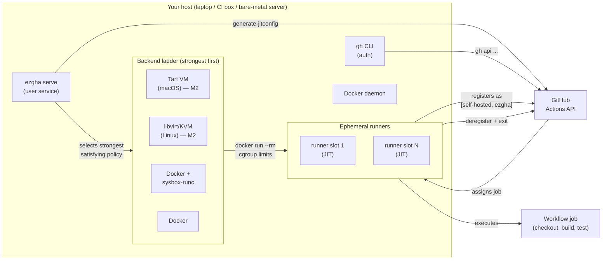
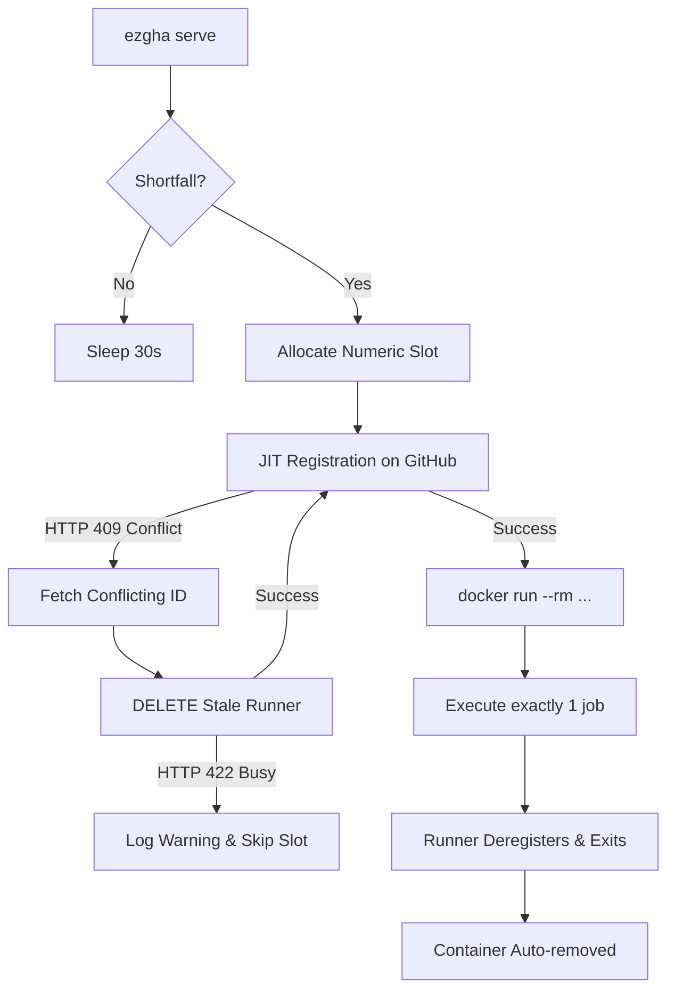

# ez-gh-actions (`ezgha`)

Easy **isolated** self-hosted GitHub Actions runners. One Rust binary that:

- runs each job in a **fresh ephemeral runner** (GitHub JIT registration — one job, then
  the runner deregisters and its container is removed),
- applies **hard resource limits** (memory, CPUs, PIDs) so a runaway job can't take the
  host down,
- **prefers the strongest isolation the host can deliver** (VM backends on the roadmap;
  Docker and Docker+sysbox today) and **fails closed** when policy demands more than
  the host offers,
- refuses to spawn work when disk is nearly full (the classic runner death spiral),
- installs itself as a user service (systemd `--user` / launchd).

The full design — including the 32-agent adversarial review that shaped v1 — lives in
[DESIGN.md](DESIGN.md). A static architecture diagram is at
[`docs/architecture.svg`](docs/architecture.svg).

## How isolation works (TL;DR)

`ezgha` runs **one ephemeral container per job** on a host you control. The runner is
JIT-registered with GitHub, executes exactly one workflow job, then deregisters and the
container is removed (`--rm`). Each job starts from a clean filesystem — workspace
pollution, zombie runners, and cache corruption are eliminated by construction.

`ezgha` uses a **VM-within-VM isolation** strategy: each runner workload executes
inside a container, which itself runs inside a VM (Colima / Lima / Docker Desktop on
macOS; QEMU microVM on Linux per `policy.minimum_isolation = "vm"`), which itself runs
on the host OS. The host kernel can never be reached directly by the runner process.

> **Terminology note.** "VM-within-VM" here means *container-in-VM-in-host*, the
> 3-layer deployed stack (container → VM → host), where the host kernel is one VM
> boundary away from the runner. It does **not** mean nesting one VM backend inside
> another VM backend (e.g. running libvirt inside a Colima VM) — that topology is
> not implemented and is a non-goal. When we say "VM-in-VM" in [DESIGN.md](DESIGN.md),
> the wiki, and the roadmap, this is what we mean.

The isolation model has three valid topologies, chosen automatically based on what
your host offers and what your policy requires:

| Topology | Where the container runs | Layers between job and host kernel | When `ezgha` picks it |
|----------|--------------------------|-------------------------------------|-----------------------|
| **Container on host** | Docker daemon on bare metal / Linux server | cgroup + namespaces + `no-new-privileges` | Default; `policy.minimum_isolation = "container"` |
| **Container inside VM** *(VM-within-VM, Mac dev setup)* | Docker daemon running inside a Colima / Lima / Docker Desktop VM | Container → VM hypervisor → host kernel | Detected via `docker info` kernel ≠ host kernel; satisfies `policy.minimum_isolation = "vm"` |
| **Container inside dedicated VM** *(roadmap — M2)* | Each job in its own Tart (macOS) or libvirt/KVM (Linux) VM | Hardware virtualization; no shared kernel | Roadmap; detected and reported by `ezgha doctor` today, drivers land in M2 |

See [DESIGN.md §"Isolation model"](DESIGN.md#isolation-model--vm-within-vm-container-in-vm-in-host)
and the [architecture diagram](docs/architecture.svg) for the full picture.

## Install

```bash
git clone https://github.com/jleechanorg/ez-gh-actions
cd ez-gh-actions && ./install.sh
```

`install.sh` is idempotent and needs no sudo: it checks prerequisites (git, Rust, a
reachable Docker daemon, an authenticated `gh`), builds and installs the `ezgha`
binary, and prints the guided next steps below. Re-run it any time to upgrade.
Uninstall with `./install.sh --uninstall` (your config is left in place).

Claude Code users get an install + diagnosis walkthrough from the
[`ezgha-install`](.claude/skills/ezgha-install/SKILL.md) skill.

## Quick start

```bash
# prerequisites: docker daemon, gh CLI authenticated (gh auth login)
cargo install --path .              # or: ./install.sh

ezgha init --target owner/repo        # detect host, write ~/.config/ezgha/config.toml
ezgha doctor                          # see backends, limits, auth status
ezgha start                           # launch ephemeral runner(s) now
ezgha status                          # managed containers + registered runners
ezgha serve                           # supervise: keep N ephemeral runners available
ezgha install-service                 # run `serve` at login, restart on failure
ezgha stop                            # kill containers, deregister idle runners
```

Point a workflow at it:

```yaml
runs-on: [self-hosted, ezgha]
```

## Architecture

### System diagram


Static SVG at [`docs/architecture.svg`](docs/architecture.svg). The same diagram in
Mermaid (renders inline on GitHub):



### Supervisor loop (per-spawn detail)

The `ezgha serve` loop runs every 30 seconds, reconciles managed containers against the
target count, and spawns shortfalls.



### Key components

1. **Supervisor loop (`ezgha serve`)** — Run as a user-level service (systemd or launchd).
   Every 30 seconds it reconciles active Docker containers against the target runner
   count and spawns shortfalls.
2. **Resilient spawning & graceful degradation** — Spawning is decoupled and
   slot-independent. If JIT registration or container spawning fails for slot *N*
   (e.g. a runner with that name is still busy on GitHub), the error is logged, the
   slot is skipped for the rest of the spawn cycle to prevent thrashing, and the daemon
   continues spawning subsequent slots.
3. **Self-healing conflict resolution** — If `generate-jitconfig` fails with an
   `HTTP 409 (Already Exists)` conflict due to a stale runner registration, the daemon
   automatically queries the GitHub API, deletes the conflicting offline runner, and
   retries the registration.
4. **Hard security & isolation gates**:
   - **Cgroup constraints** — Limits are derived dynamically from host capacity or set
     explicitly in the config (clamping memory, swap, CPUs, and PIDs).
   - **No-new-privileges** — Containers are started with `--security-opt
     no-new-privileges`. This blocks privilege escalation (`sudo` is disabled inside
     the runner container).
   - **Disk floor guard** — Measures disk space on the Docker daemon's volume before
     spawning and refuses to launch new runners if free space falls below
     `min_free_disk_gb` (preventing runner disk-exhaustion deaths).

## Backends (isolation ladder)

| Backend | Isolation | v1 status |
|---------|-----------|-----------|
| Tart (macOS Apple Silicon) | **VM** | detected, reported by `ezgha doctor`; driving runners lands in **M2** |
| libvirt/KVM (Linux) | **VM** | detected (incl. permission check), driving runners lands in **M2** |
| Docker + sysbox-runc | container+ (stronger) | **implemented** |
| Docker (bare daemon) | container | **implemented** |

`select()` picks the strongest *implemented* backend that satisfies
`policy.minimum_isolation`. Anything stronger-but-unimplemented produces a warning; a
policy violation is a hard error (fail closed).

**Daemon-in-VM reclassification.** For `policy.minimum_isolation = "vm"`, a Docker
backend counts as VM-grade containment when the daemon itself runs inside a VM — the
common desktop/dev setups (Colima, Lima, Docker Desktop) — because the host blast
radius is then bounded by the VM, not just the cgroup. We detect this by comparing the
daemon's kernel (`docker info`) against the host kernel (`uname`): a mismatch means
containers execute against a different kernel, i.e. inside a VM. Per-job isolation is
still container-grade in this case; the guarantee the policy makes is **host blast
radius**. A bare-metal Docker daemon (kernels match) stays container-tier and is
**refused** under a `vm` policy, so the fail-closed contract holds on Linux servers
where Docker shares the host kernel.

## Config (`~/.config/ezgha/config.toml`)

```toml
version = 1

[github]
scope = "repo"                  # or "org"
target = "owner/repo"           # "org-name" for org scope

[runner]
labels = ["self-hosted", "ezgha"]
count = 1                       # concurrent ephemeral runners to maintain
image = "ezgha-runner:latest"   # see "Custom runner image" below

[limits]                        # defaults derived from host capacity at init
memory_mb = 4096                # hard cgroup ceiling (swap pinned to same value)
cpus = 2.0
pids = 512
min_free_disk_gb = 10           # refuse to spawn below this floor

[policy]
minimum_isolation = "container" # "vm" = refuse to run jobs unless execution is
                                # VM-contained: a VM backend, OR a docker daemon that
                                # itself runs inside a VM (Colima/Lima/Docker Desktop),
                                # detected via daemon-vs-host kernel mismatch. A
                                # bare-metal docker daemon is refused under this policy.
```

## Security notes

- Runner containers get `--security-opt no-new-privileges`, no docker.sock, no
  privileged mode, and hard cgroup limits.
- JIT runners are single-use; nothing long-lived is stored on disk.
- `minimum_isolation = "vm"` means **VM-or-refuse**: jobs run only when execution is
  VM-contained — either a VM backend (M2) or a Docker daemon running inside a VM
  (Colima/Lima/Docker Desktop), detected by a daemon-vs-host kernel mismatch.
  Per-job isolation inside that VM is still container-grade; the guarantee is
  **host blast radius**. A bare-metal Docker daemon fails closed under this policy.
- On **public repos**: keep self-hosted workflows on `workflow_dispatch` / protected
  branches. Do not run fork PRs on self-hosted runners.

## Diagnostics & self-healing

### Fleet health check

```bash
./doctor.sh                      # full fleet health check
./docs/verify-exit-criteria.sh   # ironclad exit criteria (Gates 0–10)
```

`doctor.sh` checks: service liveness, Docker daemon, Colima VM, slot assignments, GitHub
runner fleet status (online/offline/busy), live managed containers, and recent job
execution proof.

`verify-exit-criteria.sh` machine-checks 7 ironclad gates:

| Gate | What it checks |
|------|----------------|
| 0 | Deployed binary SHA matches HEAD commit |
| 1 | Code builds, tests, clippy, fmt all pass |
| 2 | Service active + Docker/Colima daemon up |
| 3 | Fleet capacity meets targets (online + busy ≥ N−1, containers ≥ N−1) |
| 4 | Recent jobs executed successfully on the ezgha fleet |
| 7 | Automated monitoring scheduled and active |
| 10 | GitHub API rate limit budget is healthy |

### Custom runner image

The default `ghcr.io/actions/actions-runner:latest` image lacks `gh` and `jq`, causing
workflows that use these tools to fail with exit code 127. Build and use the custom
image:

```bash
docker build -f Dockerfile.runner -t ezgha-runner:latest .
```

### Stale container name-collision fix

If the daemon logs `docker run failed: Conflict. The container name ... is already in use`
in a loop, a stale container is occupying the slot name. Fix:

```bash
docker rm -f ez-org-runner-N   # replace N with the stuck slot number
```

The daemon (`≥ commit c6defc7`) includes a built-in failsafe that runs `docker rm -f`
before each `docker run` to prevent this loop.

### /doctor slash command

This repo registers a `/doctor` slash command (`.claude/commands/doctor.md`,
`.codex/commands/doctor.md`) that runs the diagnostic skill and auto-repairs common
failures.

## Status

**v1 (M1):** Docker backend end-to-end, JIT ephemeral, limits, disk floor, service
install, doctor. Backends Tart (macOS) and libvirt/KVM (Linux) are detected and
reported by `ezgha doctor`; driving them lands in **M2** (see [DESIGN.md](DESIGN.md)
milestones).